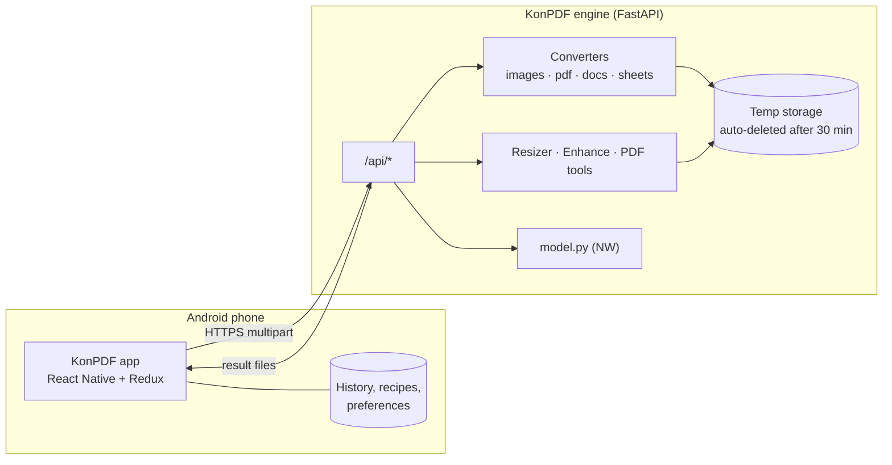

# KonPDF: Project Details

This document defines what KonPDF is, what it does, how it is built and in what order. It is the source of truth for scope: if a feature is not listed here, it is not planned yet.

| | |
|---|---|
| **What** | An Android app that converts images, PDFs, documents and spreadsheets, resizes and enhances images, and has a built-in offline assistant named **NW** |
| **Not included** | Video and audio, on purpose. Reading text from images (OCR) happens only on the phone, in the Scan tab ([section 18](#18-scan-tab-and-developer-mode)), never on the engine. |
| **Platforms** | **Android first** (React Native app) + a Python conversion engine (FastAPI). iOS later. |
| **Look** | Same neo-brutalist UI as DoAll, with a new colour palette ("Ink & Volt") |

---

## Contents

1. [What KonPDF is](#1-what-konpdf-is)
2. [Supported formats](#2-supported-formats)
3. [Resizer](#3-resizer)
4. [Enhance and filters](#4-enhance-and-filters)
5. [PDF tools](#5-pdf-tools)
6. [NW, the built-in assistant](#6-nw-the-built-in-assistant)
7. [Friendly errors](#7-friendly-errors)
8. [Other features](#8-other-features)
9. [Tech stack](#9-tech-stack)
10. [Architecture](#10-architecture)
11. [Engine in detail](#11-engine-in-detail)
12. [Mobile app in detail](#12-mobile-app-in-detail)
13. [Design language](#13-design-language)
14. [Privacy and security](#14-privacy-and-security)
15. [Testing](#15-testing)
16. [Build plan](#16-build-plan)
17. [Trade-offs and limits](#17-trade-offs-and-limits)
18. [Scan tab and Developer Mode](#18-scan-tab-and-developer-mode)

---

## 1. What KonPDF is

KonPDF is a "convert anything" toolbox for everyday files. You pick one or more files, choose what you want (another format, a smaller size, a cleaner photo, merged pages), and get the result back on your phone, ready to save or share.

You can also just type what you want. **NW**, the built-in assistant, understands requests such as *"make this photo under 50 KB for the form"* or *"isko PDF bana do"* and turns them into steps you confirm with one tap. NW runs on KonPDF's own engine from a local `model.py`. It uses no API keys and no outside AI service.

**Core features**

- Convert between image, PDF, document and spreadsheet formats ([section 2](#2-supported-formats))
- Resize images by pixels, percentage, print size, preset or **target file size** ([section 3](#3-resizer))
- Enhance and filter photos and scanned pages ([section 4](#4-enhance-and-filters))
- PDF tools: merge, split, compress, rotate, reorder, protect, unlock, watermark, page numbers ([section 5](#5-pdf-tools))
- NW assistant that understands plain language, replies in your language, and explains problems in plain words ([section 6](#6-nw-the-built-in-assistant))
- No error codes shown to users, anywhere ([section 7](#7-friendly-errors))

---

## 2. Supported formats

### Families

| Family | Read (input) | Write (output) |
|---|---|---|
| **Images** | JPG/JPEG, PNG, WEBP, BMP, GIF (first frame), TIFF (all pages), ICO, HEIC/HEIF, AVIF, SVG | JPG, PNG, WEBP, BMP, GIF, TIFF, ICO, AVIF |
| **PDF** | PDF (also password-protected, when you give the password) | PDF |
| **Documents** | DOCX, DOC*, ODT*, RTF*, TXT, Markdown (MD), HTML | DOCX, TXT, MD, HTML, PDF |
| **Presentations** | PPTX*, PPT*, ODP* | PDF* |
| **Sheets** | XLSX, XLS, ODS, CSV, TSV, JSON (array of records) | XLSX, CSV, TSV, JSON, HTML table, PDF |

\* Needs LibreOffice in the engine. The Docker image includes it. Without it, KonPDF says so in plain words ("This kind of file needs the full converter, which isn't installed on this server") instead of failing.

### Conversion matrix

| From → To | Image | PDF | DOCX | TXT / MD / HTML | XLSX / CSV / JSON |
|---|---|---|---|---|---|
| **Image** | ✅ any image format | ✅ one page per image, or all images in one PDF | ✅ images placed on pages | – | – |
| **PDF** | ✅ one image per page, chosen DPI | ✅ (PDF tools) | ✅ text and images, page by page | ✅ text | ✅ tables found on the pages |
| **DOCX / ODT / RTF** | ✅ via PDF | ✅ | ✅ | ✅ | ✅ tables in the document |
| **TXT / MD / HTML** | – | ✅ | ✅ | ✅ | – |
| **PPTX** | ✅ via PDF* | ✅* | – | ✅ slide text | – |
| **Sheets** | – | ✅ table layout | ✅ as a table | ✅ HTML / MD table | ✅ |

PDF → DOCX copies the text, images and page order. The engine does not recognise text inside scanned images; for that, the phone reads the pages (Scan tab → Read text, [section 18](#18-scan-tab-and-developer-mode)).

### Conversion options

- **Image output:** quality (1–100), background colour for formats without transparency (JPG, BMP), keep or strip metadata, ICO sizes (16–256).
- **Images → PDF:** page size (A4, Letter, Legal, A5, fit to image), orientation (auto, portrait, landscape), margins (none, small, normal), one PDF or one per image.
- **PDF → Images:** DPI (72, 150, 300), format, page range ("1-3, 7").
- **Sheets:** which sheet (or all), CSV delimiter, header row on or off.
- **Batch:** up to 20 files per job. Results come back as separate files, or as one ZIP if you choose.

---

## 3. Resizer

Images can be resized in every way people usually need, especially for online forms.

| Mode | What you set | Example |
|---|---|---|
| **Pixels** | Width and/or height, aspect lock on or off | 1920 × 1080 |
| **Percentage** | 1–400 % | 50 % |
| **Longest side** | One number; the other side follows | Longest side 1600 px |
| **Print size** | Width × height in cm, mm or inches, plus DPI | 3.5 × 4.5 cm at 300 DPI |
| **Target file size** | Maximum KB or MB (optionally a minimum too) | 20–50 KB |
| **Preset** | One tap | Passport photo, Instagram post, … |
| **DPI only** | Changes the DPI tag without touching pixels | 72 → 300 DPI |

**Fit modes** when both sides are given: *Fit* (whole image, padded with a chosen colour), *Fill* (crop to fill, with a focus point: centre, top, bottom), *Stretch*.

**Target file size** works by first lowering JPEG/WEBP quality (binary search, never below 40), then shrinking the pixels in small steps until the file fits. If the target is impossible (for example 2 KB for a 4000 px photo), KonPDF returns the closest result and says so plainly. A **minimum** size is also honoured, because some forms reject files that are *too small*.

**Presets**

| Group | Presets |
|---|---|
| ID and forms | Passport photo (35 × 45 mm), US visa (2 × 2 in), Indian govt. form photo (3.5 × 4.5 cm, 20–50 KB), signature (140 × 60 px, 10–20 KB), PAN/Aadhaar scan (under 300 KB) |
| Social | Instagram post 1080 × 1080, portrait 1080 × 1350, story 1080 × 1920, WhatsApp DP 500 × 500, YouTube thumbnail 1280 × 720, LinkedIn banner 1584 × 396, X header 1500 × 500 |
| Screens and print | HD 1280 × 720, Full HD 1920 × 1080, 4K 3840 × 2160, A4 at 300 DPI |
| Email | "Small for email" (longest side 1280, under 500 KB) |

**Also in the resizer:** crop to an aspect ratio (1:1, 4:3, 3:4, 16:9, 9:16), rotate (90° steps), flip (mirror or upside down), pad to a canvas, and *strip metadata* (removes location and camera info).

PDFs get a matching **compress to target size** tool ([section 5](#5-pdf-tools)).

---

## 4. Enhance and filters

### One-tap enhance

| Preset | What it does |
|---|---|
| **Auto enhance** | Auto levels (contrast stretch), mild sharpen, slight saturation and brightness correction. The default "make it look better" button. |
| **Document** | Greyscale, whitens the paper background and darkens ink: good for photos of pages (a cleaner image; to get the text out, use Read text) |
| **Black & white document** | Adaptive threshold for crisp black-on-white pages |
| **Low light** | Lifts shadows and brightness, reduces noise |
| **Portrait** | Soft smoothing, warm tone, gentle sharpen |
| **Upscale 2×** | High-quality Lanczos upscale plus sharpening (no AI upscaler) |
| **Denoise** | Median filter for grainy photos |

### Filters

Greyscale, Sepia, Vintage, Vivid, Cool, Warm, Fade, Noir, Invert, Blur.

### Manual sliders

Brightness, Contrast, Saturation, Sharpness, Warmth, each from −100 to +100.

The enhance screen shows a fast low-resolution **live preview** and a **before/after** compare slider. The full-resolution image is processed only when you save.

---

## 5. PDF tools

| Tool | Details |
|---|---|
| **Merge** | Several PDFs (and images) into one, in the order you arrange |
| **Split** | Every page, every N pages, or custom ranges ("1-3, 4-6") |
| **Extract pages** | Keep only chosen pages |
| **Delete pages** | Remove chosen pages |
| **Rotate** | All pages or chosen pages, 90 / 180 / 270° |
| **Reorder** | New page order |
| **Compress** | Low / medium / strong, or **target size in KB/MB**. Recompresses images and removes unused objects. |
| **Protect** | Add a password (AES-256) |
| **Unlock** | Remove a password you know |
| **Watermark** | Text, size, opacity, angle, position |
| **Page numbers** | Position and style ("1", "Page 1 of 9") |
| **Info** | Pages, page size, size on disk, whether it's protected, title/author metadata |

---

## 6. NW, the built-in assistant

### What NW does

1. **Understands requests in plain language** and turns them into a **plan**: one or more steps you see as a card and confirm with **Run**.
   - *"Compress this PDF to under 1 MB"* → `compress_pdf(target_kb=1024)`
   - *"Passport photo banao, 50kb se kam"* → `resize(preset=passport) → resize(max_kb=50)`
   - *"Merge these and add page numbers"* → `merge → page_numbers`
   - *"Convert to black and white and make it a PDF"* → `enhance(bw_document) → convert(to=pdf)`
2. **Answers how-to questions** about KonPDF: "Can I convert PPT?", "Why is my file blurry?", "Are my files kept?".
3. **Explains problems in plain words.** Every error the app shows can be opened in NW for a fuller explanation and what to try next.
4. **Suggests next steps** after a job, such as "Want it smaller? I can get this under 200 KB."

### Language friendly

- NW **detects the language** of each message and **replies in the same language**.
- Supported at launch: **English, Hindi (Devanagari), Hinglish (Hindi in Latin letters), Spanish, French, German, Portuguese**.
- Understanding is multilingual: format names, sizes ("50kb", "५० केबी", "1 MB"), dimensions ("1080x1080", "1080 by 1080"), percentages, page ranges and actions ("compress", "chhota karo", "छोटा करो", "comprimir", "compresser", "verkleinern") are recognised in all of them.
- The app's language setting can force a language; otherwise NW follows the user.
- Simple words, short sentences, no jargon ("file is too big" rather than "payload exceeds limit").

### How NW understands people

- **Typos:** misspelled keywords are corrected before matching ("compres", "pfd", "pasport", "resise").
- **Follow-ups:** "also make it under 100 kb", "make it png instead", "now convert to pdf", "pages 2-3" or "password: abcd" build on the request before; "yes", "ok do it" or "haan" confirm it.
- **Polite and casual requests:** "can you make this a pdf?", "i need this as a png", "pls convert to jpg" are requests, not questions. Real how-to questions ("are my files private?") still get answers.
- **Natural pages and passwords:** "first page", "last page", "first 3 pages", "get rid of page 2", "password laga do 1234", "lock it with 98765".
- **Knows the files:** a plan always fits what's attached (rotate is a photo job for photos and a PDF job for PDFs); attaching files after asking re-plans for them; "it's already 80 KB" when a file is already under the limit; "it's already a JPG" when there's nothing to convert; "merging needs two or more files".
- **Honest limits:** background removal, video and audio are declined kindly with what it can do instead; scanning and reading text get a button to the Scan tab; formats it can read but not write (HEIC, SVG, PPTX) get a suggestion.
- **Never a dead end:** if a request is unclear, NW says what it can do with the attached file and offers matching suggestion buttons.
- **Tested on real phrasing:** about 200 everyday requests in all seven languages (with typos and Hinglish) are turned into plans and run on real files in the test suite (`engine/tests/test_nw_conversations.py`).

### How NW runs (`engine/model.py`)

No API keys, no external AI service and no model download. NW is **not a trained model**: it is a language engine built by hand for file jobs, inside `model.py`, and runs in milliseconds on the engine.

| Part | What it does |
|---|---|
| Language detection | Script (Devanagari) and keyword scores per language; short messages with no telling words follow the phone's language |
| Typo correction | Unknown words are matched to the nearest keyword ("compres" → compress, "pfd" → pdf) |
| Understanding | A multilingual lexicon of actions, formats, presets and filters, plus extractors for sizes, dimensions, percentages, DPI, angles, page ranges, passwords and watermark text |
| Conversation memory | Follow-ups and confirmations build on the earlier request |
| Planning | Builds tool steps in a sensible order, checks them against the attached files, asks for missing details |
| Knowledge base | How-to answers, honest limits, error explanations |

Plans are never run without the user tapping **Run**, and NW can only call KonPDF's own tools. It cannot reach the network or the file system.

### NW API shape

```jsonc
// POST /api/nw/chat
{ "message": "isko 100kb se kam karo", "lang": null, "files": [{ "name": "photo.jpg", "mime": "image/jpeg", "size": 2400000 }] }

// 200
{
  "lang": "hi-Latn",
  "reply": "Ho jayega! Photo ko 100 KB se kam kar deta hoon. Run dabao.",
  "plan": { "steps": [{ "tool": "resize", "params": { "max_kb": 100 } }], "summary": "Resize to under 100 KB" },
  "suggestions": ["PDF bana do", "Passport size"],
  "engine": "core"
}
```

---

## 7. Friendly errors

**Rule: users never see an HTTP status code, a stack trace or a library error.** No "404", "402", "500", "Network Error" or "ECONNABORTED".

### How

- The engine raises only **`KonError(code, details)`**. A global handler turns every exception (including unexpected ones) into:

  ```json
  { "ok": false, "error": { "code": "FILE_TOO_LARGE", "title": "That file is a bit too big", "message": "Files can be up to 50 MB. This one is 72 MB.", "hint": "Try compressing it first, or split it into parts.", "action": "compress" } }
  ```

- `title`, `message` and `hint` are **localised** using the `Accept-Language` header (same languages as NW).
- Unknown routes, wrong methods, validation failures and crashes are all mapped too: a missing route becomes `NOT_FOUND` with "We couldn't find that. Try updating the app.", not "404".
- The app has its own mapper for failures that never reach the server (no internet, timeout, server waking up), with the same tone.
- Every error card has an **Ask NW** button that opens NW with the error code for a longer explanation.

### Error catalogue (initial)

| Code | User sees (English) |
|---|---|
| `FILE_TOO_LARGE` | That file is a bit too big |
| `TOO_MANY_FILES` | That's a lot of files at once |
| `UNSUPPORTED_FORMAT` | KonPDF can't open this kind of file yet |
| `UNSUPPORTED_CONVERSION` | That conversion isn't available |
| `CORRUPT_FILE` | This file seems to be damaged |
| `PASSWORD_REQUIRED` | This PDF is locked |
| `WRONG_PASSWORD` | That password didn't work |
| `TARGET_SIZE_UNREACHABLE` | We got close, but not quite that small |
| `INVALID_OPTIONS` | Something in the settings doesn't look right |
| `PAGE_RANGE_INVALID` | Those pages don't exist in this file |
| `NEEDS_FULL_CONVERTER` | This needs the full converter (LibreOffice) |
| `EMPTY_FILE` | This file is empty |
| `RESULT_EXPIRED` | This result has been cleared for your privacy |
| `NOT_FOUND` | We couldn't find that |
| `RATE_LIMITED` | You're going fast! |
| `BUSY` | KonPDF is busy right now |
| `TIMEOUT` | This one is taking too long |
| `INTERNAL` | Something went wrong on our side |
| *(app only)* `OFFLINE` | You're offline |
| *(app only)* `SERVER_WAKING` | Waking up the converter |
| *(app only)* `SERVER_UNREACHABLE` | Can't reach the converter |

---

## 8. Other features

- **Share to KonPDF:** appears in Android's share sheet; files shared from any app open straight in KonPDF.
- **Recipes:** save a plan as a one-tap recipe ("Govt form photo", "Email-ready PDF"). NW plans can be saved as recipes.
- **History:** recent results stay on the phone with open, share and save-again; clear any time.
- **File info:** dimensions, DPI, size, pages and format before you convert.
- **Batch:** convert, resize or enhance up to 20 files in one go.
- **Light, dark and system themes**, same as DoAll.
- **Server address setting:** use the hosted engine or a self-hosted one (same "server pill" as DoAll).

---

## 9. Tech stack

### Mobile app (`mobile/`)

Same foundation as DoAll, so the UI kit carries over unchanged.

| Area | Technology |
|---|---|
| Framework | React Native CLI (New Architecture, Hermes), TypeScript |
| State | Redux Toolkit + React Redux |
| Navigation | React Navigation (native stack) |
| Networking | Axios (multipart uploads with progress) |
| Files | KonPDF's own Kotlin module (`KonDevice`): Android's file picker, share-sheet intake, downloads, and save / share / open through the Storage Access Framework and a FileProvider; no storage permission |
| Storage | AsyncStorage (preferences, history index, recipes) |
| Graphics | react-native-svg (icon set, progress ring) |
| Fonts | Bricolage Grotesque, IBM Plex Mono, Instrument Serif (same as DoAll) |
| Tests | Jest + react-test-renderer |

### Engine (`engine/`)

| Area | Technology |
|---|---|
| Runtime | Python 3.10+ |
| API | FastAPI + Uvicorn |
| Images | Pillow (+ pillow-heif for HEIC, AVIF via Pillow), NumPy; SVG drawn by PyMuPDF |
| PDF | PyMuPDF (render, edit, compress, tables, AES-256 passwords) |
| Documents | python-docx, Markdown, PyMuPDF's HTML layout engine (PDF output without LibreOffice), LibreOffice headless (optional, full fidelity) |
| Sheets | openpyxl, pandas (xlrd for XLS, odfpy for ODS) |
| Assistant | `engine/model.py`: built-in language engine (no API key, no model download) |
| Tests | pytest + FastAPI TestClient |
| Deploy | Docker image (Python + LibreOffice), Render free plan or any container host |

---

## 10. Architecture



- The **app** handles picking, options, previews, history and sharing. It never sees raw error codes.
- The **engine** is stateless apart from short-lived temp files. Each job runs synchronously (files are small, under 50 MB) inside a time limit.
- **NW** lives inside the engine, so the app stays small and no model ships in the APK.

---

## 11. Engine in detail

### Layout

```
engine/
├── model.py                 NW assistant (built-in language engine)
├── app/
│   ├── main.py              FastAPI app, routes, error handlers
│   ├── config.py            limits and settings from environment variables
│   ├── errors.py            KonError + friendly, localised error catalogue
│   ├── i18n.py              language detection + message lookup
│   ├── storage.py           job folders, result URLs, cleanup of old files
│   ├── formats.py           format detection (by content, not just extension) + conversion matrix
│   ├── pipeline.py          runs multi-step plans (NW plans, recipes)
│   ├── converters/          images.py · pdf.py · documents.py · sheets.py · office.py (LibreOffice)
│   └── tools/               resize.py · enhance.py · pdf_tools.py
├── tests/
├── requirements.txt
└── Dockerfile
```

### Endpoints

| Method | Path | Purpose |
|---|---|---|
| GET | `/api/health` | Status, version, LibreOffice available, NW engine tier |
| GET | `/api/formats` | Conversion matrix and option schema, so the app builds its menus from the server |
| POST | `/api/info` | File details (type, dimensions, pages, size) |
| POST | `/api/convert` | `files[]`, `target`, `options` (JSON) |
| POST | `/api/resize` | `files[]`, resize options |
| POST | `/api/enhance` | `files[]`, preset / filter / sliders; `preview=true` returns a small fast JPEG |
| POST | `/api/pdf/{tool}` | merge, split, extract, delete, rotate, reorder, compress, protect, unlock, watermark, page-numbers, searchable (page pictures + the text the phone read → searchable PDF) |
| POST | `/api/run` | Runs a plan (list of steps) over the uploaded files |
| GET | `/api/files/{job}/{name}` | Download a result |
| DELETE | `/api/files/{job}` | Delete a job's files now |
| POST | `/api/nw/chat` | Talk to NW |
| GET | `/api/nw/explain/{code}` | NW's longer explanation of an error |

Every response is either `{ "ok": true, ... }` or the friendly error shape from [section 7](#7-friendly-errors).

### Limits (configurable)

| Setting | Default |
|---|---|
| `KON_MAX_FILE_MB` | 50 |
| `KON_MAX_FILES` | 20 |
| `KON_MAX_PIXELS` | 80 megapixels (decompression-bomb guard) |
| `KON_JOB_TTL_MIN` | 30 |
| `KON_JOB_TIMEOUT_S` | 120 |
| `KON_SOFFICE` | path to LibreOffice, auto-detected |

---

## 12. Mobile app in detail

### Screens

`Splash → Welcome (first run only) → Tabs (Scan · Convert · Ask NW · History) → Tool / Resizer / Enhance / PDF tools / NW / Scan result / Read text / Settings / Developer Mode → Result`

| Screen | Contents |
|---|---|
| **Scan** (tab) | Scan a document, Read text, Photos → pages, AI reader status, recent scans ([section 18](#18-scan-tab-and-developer-mode)) |
| **Home** (Convert tab) | Greeting, **"Ask NW"** bar at the top, tool grid grouped by family (Images, PDF, Documents, Sheets, Resize, Enhance), recent results strip |
| **Tool** | Picked files (with info), target format chips, options sheet, big **Convert** button, upload/convert progress |
| **Resizer** | Mode segmented control (Pixels / % / Print / Size / Preset), preset chips, live "about 48 KB, 413 × 531 px" estimate |
| **Enhance** | Preview with before/after slider, presets row, filters row, sliders sheet |
| **PDF tools** | List of PDF tools, page picker for ranges |
| **NW** | Chat with plan cards (**Run** / **Edit** / **Save as recipe**), suggestion chips, language-aware |
| **Result** | Output files with size change ("2.4 MB → 48 KB, −98 %"), **Open**, **Share**, **Save**, **Do more** |
| **History** | Past results, recipes |
| **Settings** | Theme, language, default quality, server address, Developer Mode, clear history, about |
| **Developer Mode** | On/off, phone check, AI reader download / pause / resume / delete, Wi-Fi only |

### State (Redux Toolkit)

| Slice | Holds |
|---|---|
| `files` | Files picked for the current job |
| `jobs` | Running and finished jobs, progress, results |
| `nw` | Conversation, pending plan |
| `history` | Recent results (persisted) |
| `recipes` | Saved plans (persisted) |
| `preferences` | Theme, language, default quality, server address (persisted) |

---

## 13. Design language

Same as DoAll: **neo-brutalist "paper & ink"**. Thick outlines, **hard un-blurred offset shadows**, buttons and cards that "press into" their shadow, mono uppercase labels, an Instrument Serif italic accent word in headlines ("Convert ***anything.***"), sticker-coloured chips. The same UI kit (`BrutalBox`, `BrutalPressable`, `Button`, `Sheet`, `Toast`, `Chip`, `Segmented`, `TextField`…) and fonts.

**What changes is the colour, to "Ink & Volt":** cool blue-white paper, indigo ink, an electric violet accent and a volt-yellow highlight.

| Role | DoAll | KonPDF |
|---|---|---|
| Paper (background) | `#F2EDE4` warm paper | `#EEF0F8` cool paper |
| Paper deep | `#E7E0D2` | `#DFE3F1` |
| Card | `#FFFCF6` | `#FBFCFF` |
| Ink (text, outlines, shadows) | `#121212` | `#16163A` indigo ink |
| Ink soft / faint | `#5E594F` / `#9A9386` | `#565A78` / `#9094AE` |
| Primary accent | `#FF5A1F` signal orange | `#7357FF` volt violet (white text) |
| Highlight | `#D7F75B` lime | `#FFE14D` volt yellow |
| Danger | `#E5341B` | `#E8344E` |
| Night (dark background) | `#121110` | `#0E0F22` |
| Night card / raised | `#1D1C1A` / `#272522` | `#181A35` / `#23264A` |
| Dark text | `#F2EDE4` cream | `#E8EBFA` frost |
| Dark-mode shadow | orange | violet |

**Family stickers** (chips, tool tiles): Images `#FF8F73` coral · PDF `#FF6B81` rose · Documents `#8EC5FF` sky · Sheets `#7FE3A9` mint · Resize `#FFE14D` volt · Enhance `#C8B6FF` lavender · NW `#5FE8D3` aqua. Sticker text is always ink, in both modes.

---

## 14. Privacy and security

- Uploaded files and results are stored in a per-job folder with a random ID and **deleted automatically after 30 minutes**. **Delete now** clears them at once.
- Files are never logged and never used to train anything. NW sees only file names, types and sizes, not contents.
- File types are checked by their content, not their name. Decompression bombs are refused by a pixel limit. Archive outputs are built by the engine only.
- PDF passwords are used in memory for the one job and never stored.
- No accounts and no tracking. History lives only on the phone.
- Rate limiting per IP on the hosted engine; HTTPS on hosting.

---

## 15. Testing

| Suite | Covers |
|---|---|
| Engine unit | Format detection, every conversion pair in the matrix, resizer maths (print size, aspect, target size search), enhance presets, PDF tools, page-range parsing |
| NW | Language detection for each language, intent and parameter extraction (sizes, dimensions, presets, ranges), plan validation, replies in the right language, unknown requests |
| Errors | Every error code has a message in every language; unknown routes, bad input and crashes never leak status codes or stack traces |
| API | End-to-end uploads and downloads through FastAPI's TestClient |
| Mobile | Error mapper (no status codes, every language), format matching, size formatting, server address handling, Markdown tables → CSV, Developer Mode phone check and download states, page text joining |

---

## 16. Build plan

**Android first.** The Android app is the first deliverable; iOS and web come later, if at all.

| # | Step | Status |
|---|---|---|
| 1 | **This document** | Done |
| 2 | **Android app shell:** DoAll's native project re-branded to KonPDF (`com.konpdf`, store ID `io.github.gauravtiwari31.konpdf`), "Ink & Volt" palette, new launcher icon, UI kit, navigation, themes, engine-address setting | Done |
| 3 | **Native file module** (`KonDevice`, Kotlin): pick files, receive shares, download results, save / share / open, cache clean-up; no storage permission needed | Done |
| 4 | **Android screens:** Welcome, Home, Convert, Resize, Enhance, PDF tools, NW chat, Result, History, Settings | Done |
| 5 | **Friendly errors in the app:** engine errors shown as they come, app-only problems (offline, server waking, no app to open a file) in all 7 languages, "Ask NW" on every error card | Done |
| 6 | **Engine:** format detection, converters (images, PDF, documents, sheets, LibreOffice bridge), resizer, enhance, PDF tools, plan runner, friendly error catalogue in 7 languages, Dockerfile | Done |
| 7 | **NW (`engine/model.py`):** core tier (language detection, intent and parameter extraction, plans, FAQ, error explanations) | Done |
| 8 | **Tests:** engine 822 (pytest); mobile 33 (Jest) + type-check + lint | Done |
| 9 | **Debug APK built locally** on Windows (`mobile/android/app/build/outputs/apk/debug/app-debug.apk`, arm64) | Done |
| 10 | Recipes (save an NW plan as a one-tap button) | Next |
| 11 | CI (engine tests, mobile lint / type-check / tests) and APK release workflow | Next |
| 12 | Hosting the engine on Render: `render.yaml` blueprint + [step-by-step guide](docs/deploy-render.md) | Ready to deploy |
| 12a | **v0.0.1** test release on GitHub with the APK; gear icon for Settings; text boxes stay above the keyboard | Done |
| 12b | **v0.0.2 – v0.0.4:** NW chat fixes, smarter built-in NW (no API key), hosted engine built in | Done |
| 12c | **v0.0.5 (pre-release):** bottom tab bar, Scan tab (document scanner, photos → PDF), Read text on the phone, searchable PDF, Developer Mode with the on-phone AI reader (Qwen3-VL 2B) | Done |
| 13 | Translating the app's own screen text (NW and errors are already multilingual) | Planned |
| 14 | iOS | Later |

### Build status

- The app's TypeScript, lint and tests pass, and a debug APK builds (`gradlew assembleDebug`).
- **Windows note:** this machine's Android SDK sits under a folder with a space in its name, which makes CMake call clang by its 8.3 short name (`CLANG_~1.EXE`); clang then links native libraries without the C++ library. `mobile/android/build.gradle` keeps clang in C++ mode on Windows (`--driver-mode=g++`). Building with `GRADLE_USER_HOME` on a path without spaces also avoids an "unspecified system_category error" while compiling.

### How to run it

```bash
# Engine (Python 3.10+)
cd engine
python -m venv .venv
.venv/Scripts/pip install -r requirements-dev.txt        # macOS/Linux: .venv/bin/pip
.venv/Scripts/python -m uvicorn app.main:app --host 0.0.0.0 --port 8000
.venv/Scripts/python -m pytest                            # 822 tests

# Android app (Node 22, JDK 17, Android SDK)
cd mobile
npm install
npm run android        # the emulator reaches the engine at 10.0.2.2:8000 by default
npm test && npm run typecheck && npm run lint
```

On a real phone, open **Settings → Converter engine** and enter your computer's Wi-Fi address (for example `192.168.1.20:8000`), or plug the phone in and run `npm run adb:reverse`.

---

## 17. Trade-offs and limits

- **Server-side conversion:** good-quality DOCX/PPTX/XLSX conversion needs LibreOffice and Python libraries that can't run on a phone, so conversions happen on the engine. Files are deleted after 30 minutes to keep this private.
- **Reading text only on the phone:** PDF → DOCX on the engine copies existing text; text inside scanned images is read on the phone (Scan tab). The standard reader needs Google Play services; the AI reader needs a 64-bit phone with 4 GB+ RAM and a 1.55 GB download.
- **APK size:** the AI reader's native code (llama.rn, one build per CPU generation) adds to the APK even for people who never turn Developer Mode on. It could move to an on-demand download later.
- **Pure-Python fallback:** without LibreOffice, DOCX → PDF and sheet → PDF use KonPDF's own layout (PyMuPDF's HTML engine). It keeps text, headings, lists, tables and images, but not every Word detail. The hosted engine includes LibreOffice.
- **App screen text** is English for now. NW's replies and every error message are already in all 7 languages.
- **NW is not a trained AI model.** It is a hand-built language engine: instant, free, private and offline-capable, but it only understands the kinds of requests it was built for (file jobs, how-to questions). A real language model was considered and set aside: hosted models need an API key, and running one ourselves needs about 2 GB of memory (a paid server) or a large download on every phone.
- **Free hosting cold starts:** handled as in DoAll: the app pings `/api/health` on launch and shows "Waking up the converter" instead of an error.

---

## 18. Scan tab and Developer Mode

Added in **v0.0.5** (pre-release). The app now has a bottom bar: **Scan** · **Convert** · **Ask NW** · **History**. Convert is where the app opens; Ask NW opens the chat over everything.

Reading text from images (OCR) is now part of KonPDF, with one firm rule: **it happens on the phone, never on the engine.** Pages are not uploaded to be read.

### Scan tab

| Feature | How it works |
|---|---|
| **Scan a document** | Google's ML Kit Document Scanner (through Google Play services): camera, automatic edge detection, crop, rotate, shadow and stain clean-up, many pages in one go, import from the gallery. No camera permission and no extra APK size. |
| **Your scan** | Pages in a grid: reorder, remove, add more pages, rename. **Save as PDF** is done on the phone (pages stay JPEG inside the PDF, so a page is a few hundred KB). Then **Read the text**, **Compress**, **Enhance** or **Convert pages** with the usual tools. |
| **Photos → pages** | Photos you already took become pages the same way. Phones without Google Play services (some Huawei phones) get this instead of the camera scanner. |
| **Read text** | Pick photos, scans or PDFs (up to 30 pages at a time). Copy the text, share or save it as `.txt`, **save as Word** (engine: TXT → DOCX), make a **searchable PDF** (engine: the page pictures plus an invisible text layer at the positions the phone read), or turn tables into **Excel** (AI reader). The text can be edited before saving. |

### Two readers

| | **Standard** (default) | **AI reader** (Developer Mode) |
|---|---|---|
| What | Google ML Kit Text Recognition v2, Latin and Devanagari | **Qwen3-VL 2B Instruct** (Apache-2.0), a vision-language model, run by llama.cpp through **llama.rn** |
| Download | None in the app; Play services fetches a few MB once | One time, **1.55 GB** (model Q4_K_M 1.11 GB + vision part Q8_0 445 MB), Qwen's official GGUF files from Hugging Face, no account or key |
| Speed | About a second a page | About 20–90 s a page on a mid-range phone |
| Good at | Clean print, forms, bills; keeps where each line sits (needed for a searchable PDF) | Tables (written as Markdown → Excel), columns, messy or curved pages |
| Watch out | Weaker on tables and unusual layouts | Can misread or invent a word: the app says "check names and numbers" |

"Qwen2.5-VL-2B" was considered first: it does not exist (Qwen2.5-VL starts at 3B, under a non-commercial licence), so the newer, Apache-licensed Qwen3-VL 2B was chosen.

### Developer Mode

- **Off by default.** A one-time pop-up introduces it the first time someone reaches the tabs (new installs and updates). It says what it is, the download size, and whether this phone can run it.
- **Settings → Developer Mode** turns it on and manages the model:
  - **Phone check:** 64-bit processor required; 4 GB RAM minimum, 6 GB or more recommended; about 1.9 GB free storage.
  - **Download manager:** both files download in parallel into the app's private storage; continues where it stopped (HTTP Range); **Wi-Fi only** by default; confirms before using mobile data; keeps the screen on; every file is checked against its SHA-256 before it is used; **Delete** frees the space.
- The model loads only while reading (about 2 GB of memory) and is released a minute after the last page. If the phone runs out of memory, a friendly error offers the standard reader.
- Native code: llama.rn ships one build per CPU generation for 64-bit ARM; the APK carries them compressed. Its Qualcomm NPU/GPU build is left out (it needs extra system libraries). 32-bit phones never load it.

### Tested on a phone

v0.0.5 was tested over USB on a **TECNO LJ8 (Android 16, 7.3 GB RAM)**:
- **Scanner:** opens; gallery import → review → pages back in KonPDF.
- **PDF made on the phone:** opens in Drive's PDF viewer.
- **Standard reader:** reads a printed page in under a second.
- **Searchable PDF:** built and returned.
- **Model download:** resumes after a pause and passes its SHA-256 check.
- **AI reader:** reads a marks table cell for cell in about a minute and offers Table → Excel.

**Release-build pitfall:** R8 (code shrinking) broke ML Kit's component registry, so `GmsDocumentScanning.getClient` and `TextRecognition.getClient` failed with a NullPointerException deep inside ML Kit. The camera didn't open and reading text crashed. `proguard-rules.pro` now keeps ML Kit's classes, and every scanner or reader failure becomes a friendly message plus a `KonScan` log line instead of a crash.

### Native modules

| Module | Kotlin | Does |
|---|---|---|
| `KonScan` | `scan/ScanModule.kt` | Scanner, text reader (with Play services module install), PDF page rendering, upright resized copies, pictures → PDF (`JpegPdf.kt`), text files, clipboard |
| `KonModel` | `model/ModelModule.kt` | Phone check (64-bit, RAM, storage, network), resumable verified downloads, keep screen on |

### NW

NW now sends "scan a document", "scan karo", "extract text from this photo", "make a searchable pdf" and the like (all 7 languages) to the right screen with a button (`open: "scan" | "read_text"` in its reply). "Extract the text" from a PDF or Word file is still a conversion to TXT, which needs no reading.
